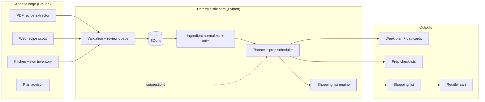

# Meal Planning System — Requirements, Milestones & Deliverables

Sep 26, 2026 · Seth Winfree

Requirement IDs (REC-1, PLN-5, NFR-3, …) are stable. Reference them in commits, tests, and ADRs.
Keep this file in sync when requirements change.

## 1. Vision and design principles

A household system that turns a weekly plan into prep sessions, daily dinners and lunches, and a
shopping list netted against what is already in the kitchen. The core is deterministic Python; AI
agents work only at the edges, where input is messy (PDFs, web pages, photos of shelves) or where
taste and discovery matter.

1. **Deterministic core, agentic edges.** Planning, scaling, unit conversion, inventory math and
   list generation are plain, tested Python. The same inputs always give the same plan and list.
2. **Agents propose, the core disposes.** An agent never writes to the database directly. It
   returns a structured proposal (a recipe, an inventory delta, a suggestion) that is
   schema-validated and, where it matters, confirmed by a person.
3. **Prep-first thinking.** The week is planned around a single Sunday prep session (soups, grains,
   proteins, washed and cut salad fixings), with dinners and lunches drawing from those components.
4. **Leftovers are a feature.** Dinner yields are sized on purpose so tonight's dinner becomes
   tomorrow's lunch.
5. **Provenance everywhere.** Every recipe and inventory item records where it came from (PDF page,
   URL, photo, manual entry) and how confident the system is.
6. **Local-first and portable.** One SQLite file, plain-text exports, and no required cloud service
   beyond the AI model and optional retailer APIs.

## 2. Scope, user stories, and weekly rhythm

Version 1 covers dinners and lunches for one household, seven days at a time. Breakfasts, nutrition
targets, and multi-household sharing are out of scope for v1, but the data model should not
preclude them.

### User stories

- As the **planner**, I pick or accept a week of dinners and see which lunches they feed.
- As the **cook**, I get a prep-session checklist (for example Sunday afternoon) ordered by oven,
  stove, and hands-on time.
- As the **shopper**, I get one list grouped by store section, minus what we already have, and can
  push it to a retailer cart.
- As a **collector**, I drop in a PDF cookbook chapter or a URL and get clean, structured recipes
  back for review.
- As an **explorer**, I ask for new ideas ("something with squash, under 40 minutes, not spicy")
  and get vetted suggestions from the web.
- As the **inventory keeper**, I photograph the fridge, freezer, or pantry and confirm a proposed
  list of what is there.
- As a **household member**, I rate meals after eating so favorites rise and misses fade.

### Default weekly rhythm

The days are configurable; the rhythm is the default.

| Day | Activity | System output |
| --- | --- | --- |
| Friday | Review suggestions, lock the plan | Draft plan, conflicts flagged |
| Friday or Saturday | Inventory snapshot (photos) | Confirmed inventory |
| Saturday | Shop | Shopping list, retailer cart |
| Sunday | Weekly prep session (the only one) | Prep checklist: soups, grains, proteins, salad fixings |
| Wednesday | Leftover and freshness check, no prep | Use-first list of Sunday components |
| Daily | Cook dinner, pack lunch | Day card: tonight's steps, tomorrow's lunch assembly |
| After meals | Rate and log leftovers | Updated favorites and inventory |

### Base week (PLN-9)

The household's standing dinners; every plan starts from these.

| Day | Dinner |
| --- | --- |
| Monday | Salmon, jasmine rice, broccoli |
| Tuesday | Tacos, alternating refried beans and meat; tomatoes, sour cream, shredded cheese, avocado, store-bought tortillas |
| Wednesday | Menu item (planner) |
| Thursday | Menu item (planner) |
| Friday | Pizza, usually ordered in |
| Saturday, Sunday | Menu item (planner) |

## 3. Architecture and data model

Three layers: agentic ingest and discovery on the left, a deterministic core in the middle, and
outputs (plans, checklists, lists, carts) on the right. Everything crosses the boundary as
validated Pydantic objects.



### Core entities

| Entity | Key fields | Notes |
| --- | --- | --- |
| Recipe | id, title, servings, times (prep, cook, total), tags, source, status (draft, approved) | Source = PDF + page, URL, or manual |
| RecipeIngredient | recipe_id, raw_text, ingredient_id, qty, unit, prep_note, optional | Raw text kept for audit |
| Step | recipe_id, order, text, equipment, active_minutes, passive_minutes | Times drive prep scheduling |
| Ingredient | id, canonical_name, aliases, category (store section), density, default_unit, shelf_life_days | The normalization backbone |
| Component | id, name, recipe_id, yield, storage, keeps_days | A prep-ahead item (soup, grain, dressing, chopped greens) |
| MealSlot | date, meal (lunch, dinner), recipe_id or component list, servings, is_leftover_of | One row per planned meal |
| PrepSession | date, component list, ordered tasks, est_minutes | Generated, not hand-entered |
| InventoryItem | ingredient_id, qty, unit, location (fridge, freezer, pantry), added_on, best_by, source, confidence | Source = photo, receipt, manual, consumed-by-plan |
| ShoppingList / Line | week, ingredient_id, qty_needed, qty_on_hand, qty_to_buy, pack_size, section, retailer_sku | Net of inventory, rounded to pack sizes |
| Rating | recipe_id, date, score (1–5), would_repeat, notes | Feeds favorites |
| Preference | key, value | Household rules: dislikes, spice level, max weeknight minutes |
| RecipeFamily | id, name, preferred_recipe_id; Recipe gains family_id | Groups variants of one dish (e.g. three injeras); one dish for variety rules |

Implementation: `src/mealplan/models/tables.py`. It adds `RecipeSource` (one row per copy, for
REC-3 and ING-4), `SkuMatch` (RTL-3), and `AgentCall` (NFR-7).

## 4. Functional requirements by module

### Recipe library (REC)

- **REC-1** Store recipes in a canonical schema compatible with schema.org/Recipe, plus local
  fields (components, active vs passive time).
- **REC-2** Parse every ingredient line into qty, unit, ingredient, and prep note; keep the raw line.
- **REC-3** Separate copies from variants. The same recipe saved twice (same source) collapses to
  one record that keeps every page reference. Different recipes for the same dish (for example
  three injeras) stay as separate recipes grouped in a variant family. Grouping uses normalized
  title plus ingredient-set similarity, and a person confirms it; nothing merges silently.
- **REC-4** Tag recipes (cuisine, protein, season, weeknight-friendly, freezer-friendly,
  lunch-friendly).
- **REC-5** Favorites are computed from ratings and repeat history, with a manual pin override.
- **REC-6** Scale recipes to any serving count with unit-aware rounding (no "0.33 eggs").
- **REC-7** Collections: every recipe is **core** (the household's own digitized recipes, imported
  first) or **discovered** (found by agents). A discovered recipe is promoted to core after it is
  cooked and rated 4+, or by hand.
- **REC-8** Core is the source of truth: no import or agent find overwrites a core recipe, and a
  near-duplicate of a core recipe is offered as a new variant in that recipe's family, not as a
  separate dish.
- **REC-9** Variant families: each family has a name and a preferred variant (default: highest
  rated). The planner treats a family as one dish for variety rules and picks the preferred variant
  unless asked. Ratings are kept per variant, so the preferred one can change over time.

### Ingestion (ING)

- **ING-1** PDF import: extract text per page (and page images for scanned PDFs), send to the
  extraction agent, return one or more draft recipes with page references.
- **ING-2** URL import: try structured data first (JSON-LD schema.org/Recipe via a scraper
  library); fall back to the agent only when structure is missing.
- **ING-3** All imports land as **draft** in a review queue; approval is a person's action.
- **ING-4** Store source attribution (title, author, URL or file + page) on every recipe.
- **ING-5** Chat import without an API key: the app cuts the missing recipes' pages into small
  batch PDFs with a prompt; the person runs them in a Claude chat and pastes the JSON reply
  back. The reply is parsed as data (never followed), previewed recipe by recipe, and imported
  as drafts through the same path as the API extractor, tagged `claude-chat` with page-level
  provenance and 0.75 confidence.
- **ING-6** A recipe editor (web) for fixing drafts before approval and approved recipes later:
  fields, ingredient lines (re-parsed and re-matched on save), steps with hands-on/waiting
  minutes and equipment. Sources, ratings and family are kept.
- **ING-7** Local extraction: a second extractor behind the same interface reads page images
  with Docling (OCR and layout) and structures them with a model served by Ollama, using the
  same JSON schema, grounding check and retry as the Claude extractor. Chosen with
  `MEALPLAN_EXTRACTOR` (auto, claude, local, none) or on the Setup page; calls are logged with
  cost 0. Docling is an optional extra.

### Planner and prep scheduler (PLN)

- **PLN-1** Generate a 7-day plan of dinners and lunches from rules: household preferences, max
  weeknight active time, variety (no protein more than N times), seasonality, and favorites
  weighting.
- **PLN-2** Prefer recipes that use inventory items nearing their best-by date.
- **PLN-3** Link leftovers: a dinner sized for extra servings fills a named next-day lunch slot.
- **PLN-4** Lunch templates: assemble from components (soup + salad base + protein + dressing)
  rather than full recipes.
- **PLN-5** Build prep sessions: collect every component for the week in the one Sunday session,
  respect `keeps_days` (freeze items meant for late in the week, or make short-lived ones a
  10-minute day-of task), and order tasks by critical path (oven and simmer first, hands-on work in
  parallel).
- **PLN-6** Produce a day card per day: what to reheat or cook tonight, what to pack for tomorrow.
- **PLN-7** Plans are reproducible: same inputs and random seed give the same plan. Manual swaps
  are recorded as overrides.
- **PLN-8** Plans draw mainly from core recipes; discovered recipes enter at a capped rate
  (default: at most one new dinner per week).
- **PLN-9** Base week: standing dinners every plan starts from, per weekday — one recipe, or
  several that rotate week by week. Standing meals repeat by design (no repeat-window or
  weeknight-time check) and are not chosen for other days; a manual swap still wins. Days
  without a standing meal are chosen by the planner.

### Inventory (INV)

- **INV-1** Track items by ingredient, quantity, unit, location, and best-by date.
- **INV-2** Photo inventory: the vision agent returns a proposed delta (add, remove, adjust) with
  per-item confidence; nothing changes until confirmed.
- **INV-3** Deduct planned usage when a meal is marked cooked; add yields of prepped components.
- **INV-4** Staples list (salt, oil, spices) with "assume on hand" and periodic check reminders.
- **INV-5** Expiring-soon report feeds the planner (PLN-2).

### Shopping list (SHP)

- **SHP-1** Aggregate all planned ingredients across the week, normalized to one unit per
  ingredient.
- **SHP-2** Subtract inventory on hand; keep the math visible (needed, have, buy).
- **SHP-3** Round up to purchasable pack sizes where known.
- **SHP-4** Group by store section, ordered to a configurable store layout.
- **SHP-5** Export as Markdown, printable PDF, and plain text for phone notes or reminders apps.

### Retailer integration (RTL)

- **RTL-1** Adapter interface: `search_product`, `match_line`, `add_to_cart`, `get_store`. One
  adapter per retailer.
- **RTL-2** First candidates to evaluate: Kroger's public developer API (product search, cart) and
  Instacart's developer platform (shoppable list links). Both must be verified in M0 for current
  terms and access.
- **RTL-3** Remember confirmed product matches (ingredient to SKU) so the second week is mostly
  automatic.
- **RTL-4** The system never places or pays for an order; it fills a cart or produces a link for a
  person to finish.

### Interfaces (UI)

- **UI-1** CLI first (plan, import, inventory, list, prep, rate).
- **UI-2** MCP server exposing the same operations, so Claude can drive the system
  conversationally.
- **UI-3** A light web or phone-friendly view for the week, day cards, and the shopping list
  (delivered by the web app, UI-4 to UI-7, in M4).
- **UI-4** Web app for planning, searching and reviewing: a JSON API served by the local Python
  process over the same core functions as the CLI, and a lightweight JavaScript frontend with no
  build step (vendored Preact + htm, no CDN at runtime). Cross-platform in any modern browser,
  desktop or phone, and ready to run on a home server later.
- **UI-5** Screens: week plan (view, re-plan, swap, lock, mark cooked, day cards, prep
  checklist); recipe search (filter by text, role, tag, family, rating; open, scale, rate);
  review queue (approve, reject, merge copies, group variants); shopping list and inventory
  (checklist, exports, add and edit items, staples check).
- **UI-6** Access: one household password; a signed, HttpOnly, SameSite session cookie; login
  attempts rate-limited; state-changing requests need JSON and a custom header (CSRF). Binds to
  this computer by default; serving on the home network is an explicit option.
- **UI-7** Same guarantees as the CLI: every write goes through the core functions (agents still
  never write), errors are shown rather than swallowed, and pages stay readable on a phone
  (NFR-9).
- **UI-8** First run without the terminal: one command (`mealctl serve`) creates the database,
  loads the catalog, asks once for the household password and opens the browser. A new install
  shows a "Get started" guide: import the collection PDF from the browser (web prints free,
  other pages via the extractor when an API key is set, with progress), approve the drafts that
  have no issues in one step, then plan the week. The Anthropic API key can be pasted there:
  it is tidied (variable name, quotes), checked with a free Models API call, and saved to
  `.env`; a rejected key or an empty account stops an import with one clear message. `mealctl serve --demo` runs a sample household
  in a separate database so the app can be tried before any import.

## 5. Agentic components and guardrails

Four agents, each with a narrow job, a fixed output schema, and a small tool set. They are built on
the Claude API (tool use) or the Claude Agent SDK, and call the deterministic core through the same
functions the CLI uses.

| Agent | Input | Tools | Output (schema) | Human gate |
| --- | --- | --- | --- | --- |
| PDF recipe extractor | Page text + page images | none (pure extraction) | `list[RecipeDraft]` with page refs | Review queue |
| Web recipe scout | Natural-language request + preferences + inventory | web search, fetch, structured scraper, library search (to avoid duplicates) | `list[RecipeSuggestion]` with URL and reason | Pick to add as discovered |
| Kitchen vision inventory | 1–N photos + location tag | ingredient lookup | `InventoryDelta` with per-item confidence | Confirm delta |
| Plan advisor | Draft plan + constraints | read-only core queries | Swap suggestions with rationale | Accept or ignore |

### Guardrails

- **Schema-first.** Every agent response is parsed into a Pydantic model; a parse failure triggers
  one retry with the error, then lands in a failed queue.
- **No direct writes.** Agents get read tools only. Writes happen when a person approves a proposal.
- **Grounding.** Extracted recipes must be traceable to source text; the validator checks that each
  ingredient's raw line appears in the source.
- **Confidence thresholds.** Vision items under a set confidence (for example 0.6) are shown as
  questions, not additions.
- **Allergen and dislike check.** Deterministic filter on every suggestion; the agent's own claim is
  not trusted.
- **Attribution and use.** Web recipes store the source URL and are for personal household use; the
  scout prefers sites that publish structured recipe data.
- **Cost and logging.** Each agent call logs model, tokens, latency, and outcome to a local table; a
  weekly budget cap is configurable.
- **Evals.** A small fixed test set per agent (10 PDF pages, 10 URLs, 10 kitchen photos) with
  expected outputs, run on every prompt change.

## 6. Non-functional requirements

| ID | Requirement | Target |
| --- | --- | --- |
| NFR-1 Determinism | Core functions are pure given DB state + seed | Golden-file tests pass byte-for-byte |
| NFR-2 Test coverage | Core package (normalizer, planner, lists, inventory) | 85% line coverage or more |
| NFR-3 Speed | Plan + shopping list for 7 days | Under 2 s locally, excluding agent calls |
| NFR-4 Portability | Single SQLite file, migrations via Alembic | Runs on macOS and Linux, Python 3.12+ |
| NFR-5 Privacy | Photos and household data stay local | Only prompts and images sent to the model API |
| NFR-6 Secrets | API keys in `.env` or OS keychain | Never committed; pre-commit check |
| NFR-7 Observability | Structured logs; agent call log table | Every agent call traceable |
| NFR-8 Backup | Nightly copy of the DB plus JSON export | Restore tested once per milestone |
| NFR-9 Accessibility | Day cards and lists readable on a phone | Large type, no horizontal scroll |

## 7. Core recipe collection

`Recipes_12Sept26.pdf` (174 pages, merged from about 47 files) holds **93 distinct recipes** once
duplicates are removed. Each is listed with its pages, source, and household notes in
[`data/core_recipe_manifest.json`](../data/core_recipe_manifest.json) (also as CSV). The source PDF
itself is not committed (see `data/README.md`).

| Page type | Recipes | Extraction path in M1 |
| --- | --- | --- |
| Text web prints (date, URL and page header) | 31 | Text layer + deterministic parser |
| NYT Cooking prints, title drawn as an image | 10 | Text layer for the body; title read from the page image |
| Designed booklets (steamed dishes, Icelandic) | 20 | Text layer, but columns interleave; layout-aware parse or agent |
| Tall one-page web captures (ads, comments, nav) | 13 | Agent extraction with grounding check |
| Notebook pages with app screenshots | 18 | Vision only; no text layer |
| Scanned cookbook page | 1 | Vision |

M1 therefore runs in two passes: 41 recipes through the deterministic path, then 52 through the
agent path with review. The extraction agent is needed from day one, not only in M5.

What the collection tells the design:

- **Dinner-heavy.** 47 dinners, 16 desserts, 7 soups, 6 lunches, 6 breads, 5 sides, 3 breakfasts.
  Sunday-prep lunches have little to draw on, so the web scout's first brief is soups, grain salads
  and lunch bowls.
- **Your handwriting is data.** Notes such as *Excellent*, *Awesome*, *OK not great*, *x2* and
  *double recipe* become seed ratings, scaling defaults and freezer tags.
- **Freezer meals are already the habit.** The notebook lists Sloppy Joes, egg casserole squares,
  butter chicken and Hawawshi pitas (no Hawawshi recipe is saved yet).
- **Copies and variants are both present.** Sloppy Joes (saved 5 times) and the stuffing page are
  plain copies to collapse. Four dishes become variant families: injera (3 versions), butter
  chicken (2), shakshuka (2) and sourdough (2).
- **Not recipes.** A dog-treat page, planning-notebook pages and a low-carb weekly meal plan (kept
  as a planner test case) are excluded.
- **Only 20 of 93 pages carry a usable recipe URL.** Those can be re-fetched as structured data to
  check extraction accuracy.

## 8. Milestones and deliverables

Eight milestones, each ending in something usable in the kitchen. The deterministic core ships
first (M1–M3) and gets a web interface (M4) before any agent work, so every agent later has a
solid, tested target to write into and a screen to review its output. The library starts from
the core digitized recipes in M1; recipes found by agents are added on top from M5 onward.
Durations assume part-time evenings and weekends with Claude Code doing most of the typing.

| # | Milestone | Deliverables | Acceptance criteria | Est. |
| --- | --- | --- | --- | --- |
| M0 | Foundations | Repo, `pyproject`, CI (ruff, mypy, pytest), SQLite + Alembic, Pydantic models, `CLAUDE.md`; retailer API access verified | CI green; `mealctl --help` runs; decision note on Kroger vs Instacart | 1 wk |
| M1 | Core recipe library + normalizer | Import of the core digitized recipe collection (PDF extractor + review queue), recipe CRUD, ingredient parser, unit conversion (pint), ingredient catalog seeded with ~300 staples | Whole core collection imported and approved; 95%+ of ingredient lines parse with no edits | 2 wk |
| M2 | Planner + prep scheduler | Rule-based 7-day plan, leftover linking, lunch templates, prep sessions, day cards | Golden-week tests pass; a real week is planned and cooked from it | 2–3 wk |
| M3 | Inventory + shopping list | Manual inventory, cooked/consumed deductions, aggregated list net of inventory, section grouping, exports | List for a golden week matches hand-computed list exactly | 2 wk |
| M4 | Web app | JSON API over the core with household password (UI-4, UI-6); Preact + htm frontend with week plan, recipe search, review queue, shopping list and inventory screens (UI-5); `mealctl serve` | Every screen works on desktop and phone; a browser test covers plan, swap, list, inventory and review end to end; nothing is reachable without the password | 1–2 wk |
| M5 | Agentic discovery | Web recipe scout, JSON-LD URL import, discovered-recipe queue, promotion to core, eval sets | Scout suggestions respect all dislikes and skip near-duplicates of core; 20 URLs import with no agent | 2–3 wk |
| M6 | Vision inventory | Photo-to-delta agent, confidence thresholds, confirm flow | On 10 test photos, recall 80%+ for clearly visible items; zero unconfirmed writes | 2 wk |
| M7 | Retailer + MCP | Retailer adapter (first choice from M0), SKU memory, MCP server | A real week's list goes to a cart with under 10 manual fixes; week two under 3 | 2–3 wk |

### Cross-cutting deliverables

- `docs/requirements.md` (this document), kept in sync with requirement IDs.
- `docs/decisions/` short architecture decision records (ADRs), one per notable choice.
- `tests/golden/` fixed weeks, recipes, and expected plans and lists.
- `evals/` per-agent test sets with a single `make evals` command.
- A short user guide: the Friday-to-Sunday routine in five commands.

## 9. Repo layout, stack, and Claude Code handoff

### Suggested stack

| Concern | Choice | Why |
| --- | --- | --- |
| Language | Python 3.12+, `uv` for env and deps | Fast, reproducible |
| Models and validation | Pydantic v2, SQLModel or SQLAlchemy 2 | One schema for DB, API, and agents |
| Storage | SQLite + Alembic | Local-first, single file |
| Units | `pint` + a custom density table | Volume to weight for flour, rice, etc. |
| Ingredient parsing | `ingredient-parser-nlp` or a rules parser, agent fallback | Deterministic first |
| Web recipes | `recipe-scrapers` (JSON-LD) | Most recipe sites publish structured data |
| PDFs | `pymupdf` for text and page images | Handles text and scanned pages |
| Planner | Scored greedy search with seed; OR-Tools CP-SAT if constraints grow | Start simple, upgrade if needed |
| CLI | Typer + Rich | Readable tables in the terminal |
| Agents | Anthropic SDK tool use or Claude Agent SDK | Structured outputs, vision |
| MCP | Python MCP SDK | Lets Claude drive the system |
| Web API | FastAPI + uvicorn | Same Pydantic types as the core; one local process |
| Web frontend | Preact + htm, vendored ES modules, no build step | Tiny, no Node needed to run or host |
| Tests | pytest, hypothesis, golden files | Determinism is testable |

### Repo layout

```
CLAUDE.md
pyproject.toml
docs/requirements.md  docs/decisions/
src/mealplan/
  models/        # Pydantic + DB models
  core/          # normalizer, units, planner, prep, shopping, inventory
  ingest/        # pdf.py, url.py, review_queue.py
  agents/        # extractor.py, scout.py, vision.py, advisor.py, prompts/
  retail/        # base.py, kroger.py, instacart.py
  migrations/    # Alembic
  web/           # app.py (JSON API, auth), static/ (Preact + htm frontend)
  cli.py
  mcp_server.py
tests/  tests/golden/
evals/
data/            # core recipe manifest, seed ingredient catalog, store layout
```

### Handoff notes for Claude Code

1. Put this document in `docs/requirements.md` and write a short `CLAUDE.md` pointing to it,
   listing the principles in section 1 and the commands to run tests.
2. Work one milestone per branch; start each session by naming the milestone and requirement IDs in
   scope.
3. Ask Claude Code to write the golden tests for a milestone before the implementation.
4. Keep agents behind interfaces in `agents/` so the core can be tested with fakes and no API calls.
5. Record each notable choice as a one-page ADR (for example ADR-001 planner algorithm, ADR-002
   retailer choice).
6. Use plan mode at the start of M2 and M5; those are the two milestones with the most design
   surface.

## 10. Open questions and risks

### Open questions

- ~~Household size and servings per meal; does everyone eat the same lunch?~~ — answered:
  dinner for 4; two people pack the same lunch Monday to Friday.
- Which grocery retailers do you actually use? This decides the M7 adapter.
- ~~Prep sessions per week~~ — decided: a single session on Sundays.
- ~~Dietary rules, allergies, and hard dislikes to encode in `Preference`.~~ — answered: no
  very spicy food; weeknight dinners at most 45 minutes hands-on (`mealctl prefs`).
- ~~Core collection~~ — answered: `Recipes_12Sept26.pdf`, 93 recipes, mixed text and image pages
  (see section 7).
- ~~Primary interface after the CLI: phone web view, or mostly conversational through MCP?~~ —
  answered: a web app (M4), password-protected, able to move to a home server later.

### Risks

| Risk | Impact | Mitigation |
| --- | --- | --- |
| Ingredient normalization is harder than it looks ("1 can tomatoes", "a handful of basil") | Wrong lists | Catalog with aliases and pack sizes; flag unknowns for review, never guess silently |
| Retailer API access or terms change | M7 blocked | Adapter interface; Instacart link or plain export as fallback |
| Vision misses items in cluttered fridges | Inventory drift | Per-shelf photos, confirm step, and consumption tracking reduce reliance on photos |
| Web recipe sites block scraping or lack structure | Scout quality drops | Prefer structured-data sites; manual paste import as fallback |
| Plan feels rigid in real life | Low adoption | One-tap swaps, "skip tonight" that re-flows leftovers, ratings that learn |
| Agent costs creep | Budget | Per-agent logging and weekly cap (NFR-7) |
